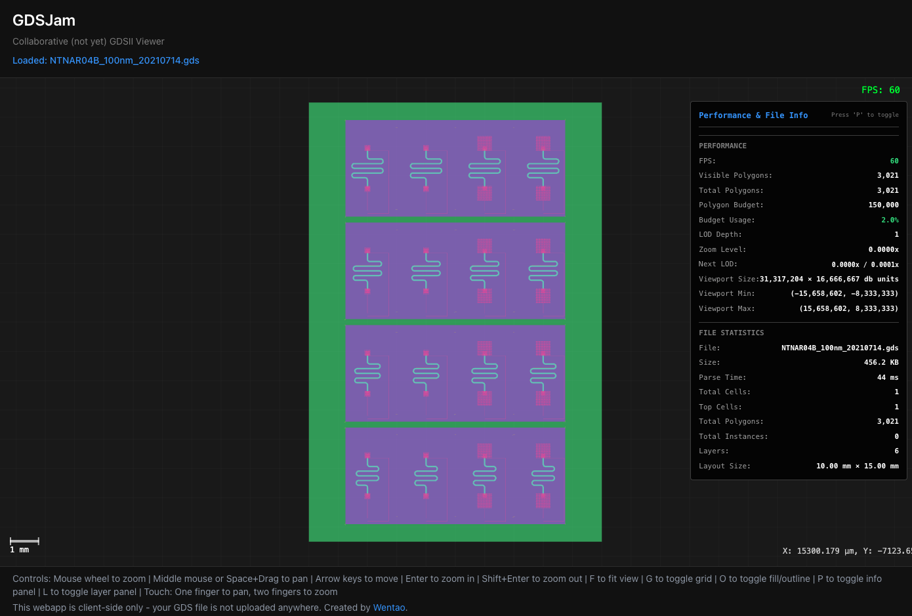
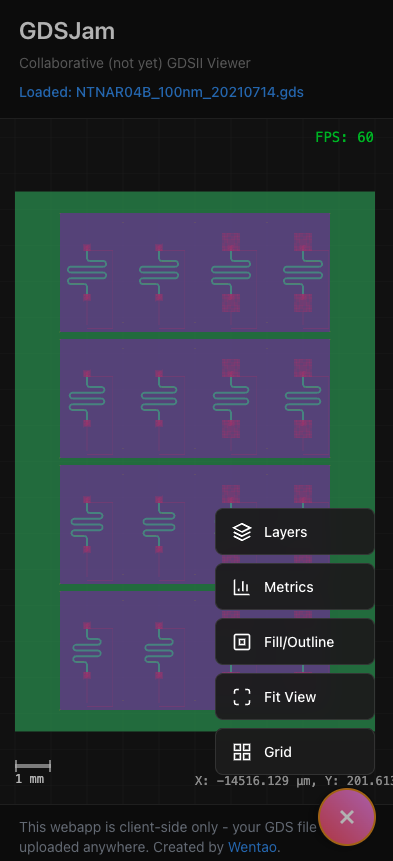

<div align="center">
  <a href="https://gdsjam.com"></a>

  # GDSJam

  Web-based GDSII viewer for semiconductor layout visualization.

  [https://gdsjam.com](https://gdsjam.com)

  [](https://github.com/jwt625/gdsjam/actions/workflows/ci.yml)
  [](https://github.com/jwt625/gdsjam/actions/workflows/deploy.yml)
  [](https://opensource.org/licenses/MIT)
  [](https://www.typescriptlang.org/)
  [](https://svelte.dev/)
</div>

## Overview

GDSJam is a client-side web application for viewing GDSII files directly in the browser. Built for academics, chip design newcomers, and the photonics community to promote open-source EDA culture.


## Screenshots

<div align="center">
  
  
  <br>
  <sub>Desktop view (left) and mobile view (right)</sub>
</div>

## Features

- Client-side GDSII file rendering with WebGL acceleration
- Interactive zoom, pan, and navigation controls
- Layer visibility controls with color customization
- Cell hierarchy navigation
- Performance optimized for large files (LOD rendering, viewport culling)
- Dark mode interface
- Mobile-friendly touch controls

## Technology Stack

- **Frontend**: Svelte 5 + TypeScript + Vite
- **Rendering**: [Pixi.js](https://pixijs.com/) v8 (WebGL2)
- **GDSII Parsing**: [gdsii](https://github.com/TinyTapeout/gdsii) by TinyTapeout
- **Spatial Indexing**: [rbush](https://github.com/mourner/rbush) (R-tree for viewport culling)
- **Styling**: Tailwind CSS v4
- **Tooling**: Biome, Vitest, Husky

## Development

```bash
# Install dependencies
pnpm install

# Start dev server
pnpm dev

# Run type checking
pnpm check

# Run linter
pnpm lint

# Run tests
pnpm test
```

## Architecture

### Renderer Architecture

The renderer is built with a modular architecture where `PixiRenderer` serves as a thin orchestrator coordinating specialized modules:

```
PixiRenderer (orchestrator)
├── InputController
│   ├── MouseController - Wheel zoom, pan, coordinates
│   ├── KeyboardController - Arrow keys, shortcuts
│   └── TouchController - Touch pan, pinch zoom
├── ViewportManager - Viewport culling, visibility
├── LODManager - Level of Detail optimization
├── ZoomLimits - Zoom constraints (1nm to 1m scale bar)
├── GDSRenderer - Document rendering, polygon batching
└── UI Overlays
    ├── FPSCounter
    ├── CoordinatesDisplay
    ├── GridOverlay
    └── ScaleBarOverlay
```

### Key Design Principles

- **Coordinate System**: Micrometers (µm) with Y-up Cartesian convention (GDSII standard)
- **Rendering Strategy**: Level-of-Detail (LOD) rendering with polygon budgeting
- **Spatial Indexing**: R-tree for efficient viewport culling
- **Performance**: Viewport culling, spatial tiling, incremental re-rendering
- **Modularity**: Single-responsibility modules with clear interfaces

## Acknowledgments

This project uses the following open-source libraries:

- **[gdsii](https://github.com/TinyTapeout/gdsii)** - GDSII parser by TinyTapeout (MIT/Apache-2.0)
- **[Pixi.js](https://pixijs.com/)** - WebGL rendering engine (MIT)
- **[rbush](https://github.com/mourner/rbush)** - High-performance R-tree spatial index by Vladimir Agafonkin (MIT)
- **[Svelte](https://svelte.dev/)** - Reactive UI framework (MIT)

## Documentation

See `DevLog/` directory for detailed planning and implementation notes.


## Privacy

**Without collaboration sessions:** This webapp is entirely client-side — all file processing happens in your browser and your files never leave your device.

**With collaboration sessions:** When you host or join a session:
- **Files you upload** are temporarily stored on our server for sharing with session participants
- Files are stored as content-addressed blobs (SHA-256 hash) and **automatically deleted after 7 days**
- We log **IP addresses** for rate limiting (max 10 uploads/hour) and security purposes
- **No user accounts** are created — we don't track personal information beyond what's technically necessary
- Session metadata (file name, size, uploader ID) is synchronized via WebRTC to session participants

**Recommendation:** Do not upload files containing sensitive or proprietary designs if you're not comfortable with temporary server-side storage.


## License

MIT

## Author

Created by [Wentao](https://outside5sigma.com/) and Claude.
